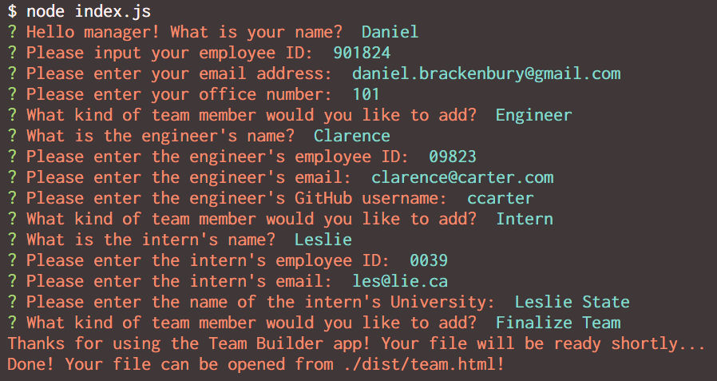
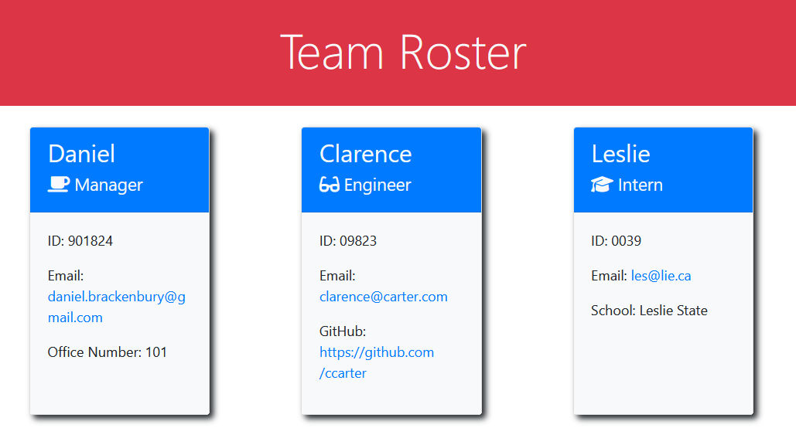

# Team Profile Generator

## Description

Accepts input from a user in order to create an HTML page displaying profiles for their company's team roster.

## Table of Contents
- [Installation](#installation)
- [Usage](#usage)
- [Images](#images)
- [Features](#features)
- [Credits](#credits)

- [Tests](#tests)

- [License](#license)

## Installation

This application uses node.js; navigate to the directory containing index.js and run npm install from the commandline in order to get the dependencies necessary to run it.

## Usage

Similar to installation, once npm install has been run and the dependencies acquired, simply type "node index.js" in the same directory and the application will run and prompt you to enter your information!

A demonstration video of how to run the app, as well as any included unit tests, is available on [YouTube](https://www.youtube.com/watch?v=2UEIMz24KMc).

## Images

## Features

- Add as many team members as you'd like; even feel free to extend to default class behaviours with more of your own.

- The generated HTML is a straightforward and simple template that serves as a great base for expansion.

## Credits

Created by [Daniel Brackenbury](https://github.com/helpvisa).

## Tests

- Class and prompt tests are included in this release (look under the __tests__ directory). They use jest to run; simply type "npm test" in the directory containing index.js (the main repository directory) and see them run for yourself.

## License

Copyright 2022 Daniel Brackenbury

Permission is hereby granted, free of charge, to any person obtaining a copy of this software and associated documentation files (the "Software"), to deal in the Software without restriction, including without limitation the rights to use, copy, modify, merge, publish, distribute, sublicense, and/or sell copies of the Software, and to permit persons to whom the Software is furnished to do so, subject to the following conditions:

The above copyright notice and this permission notice shall be included in all copies or substantial portions of the Software.

THE SOFTWARE IS PROVIDED "AS IS", WITHOUT WARRANTY OF ANY KIND, EXPRESS OR IMPLIED, INCLUDING BUT NOT LIMITED TO THE WARRANTIES OF MERCHANTABILITY, FITNESS FOR A PARTICULAR PURPOSE AND NONINFRINGEMENT. IN NO EVENT SHALL THE AUTHORS OR COPYRIGHT HOLDERS BE LIABLE FOR ANY CLAIM, DAMAGES OR OTHER LIABILITY, WHETHER IN AN ACTION OF CONTRACT, TORT OR OTHERWISE, ARISING FROM, OUT OF OR IN CONNECTION WITH THE SOFTWARE OR THE USE OR OTHER DEALINGS IN THE SOFTWARE.
